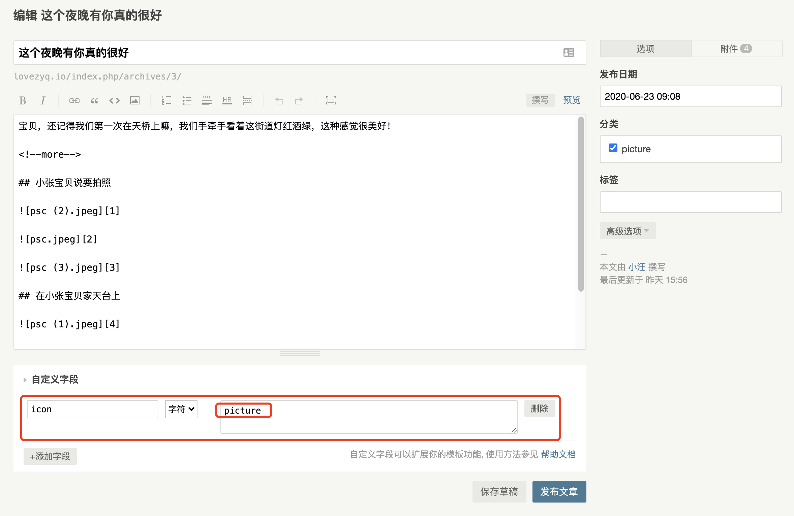

## RecordLove For Typecho Theme

原本这是写给我小张宝贝的Typecho记录爱情的主题

发现还不错，觉得挺好的，现开源给大家使用，主题开源随便造

有好想法可联系我

## 安装

-   安装好Typecho
-   将本项目复制到Typecho主题文件夹，直接下载的文件夹注意不要带`-master`这样的字样
-   在后台启用即可

## 如何使用

### 主页小图标使用说明

主页小图标共有4个，分别为`picture`、`flag`、`movie`、`loaction`

#### picture

#### flag

#### movie

#### location

#### 如何添加呢？

在文章编辑中，点击自定义字段，添加一个字段名为`icon`的字段，值为`picture`、`flag`、`movie`、`loaction` 其中的一个

### 主页上方标题

在主页上方标题可在`后台->控制台->设置外观->启用本主题->设置外观->主页标题`中修改

### 头部昵称修改

头部昵称修改可在`后台->控制台->设置外观->启用本主题->设置外观->男生姓名/女生姓名`中修改

### 头部背景颜色

可自定义颜色或者选择固有的主题颜色，固有的主题颜色选择范围为数字`1-6`

## 主题说明

本主题功能很少，主要记录小情侣之间的点点滴滴

需要其他功能可自行开发

## 主题预览

### 主页

### 文章详情页

## 开源协议及免责申明

### 开源协议

RecordLove遵循GPL3.0开源协议发布，并提供免费使用，您可以自由传播和修改，在遵照下面的约束条件的前提下：

一.用户可以自由地使用及二次发布本软件而不必征得原作者同意。

二.在二次发布时请务必不要删除这个使用协议。

三.请不要删除软件底部的名称及版权信息，二次开发者可保留自己的版权信息。

只要你遵循上述条款规定，您就可以自由使用并传播本源代码。

### 免责申明

禁止非法出售本源码